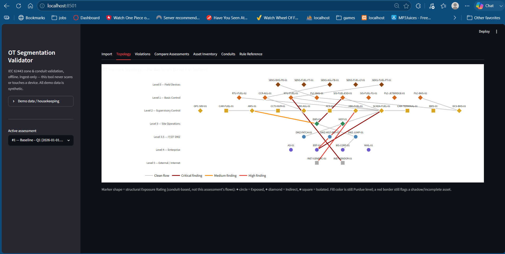
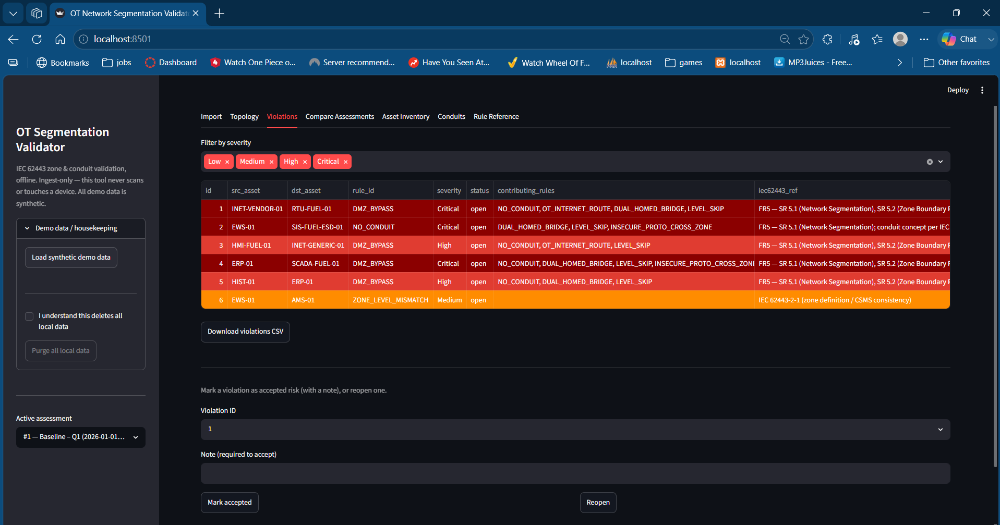
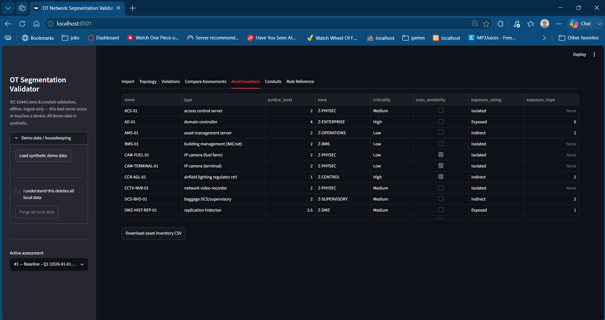
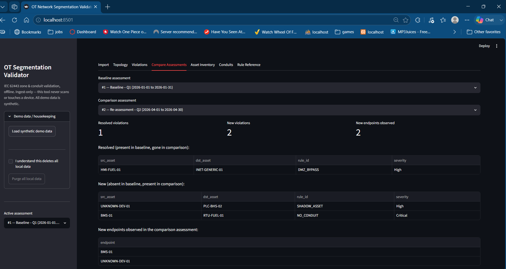
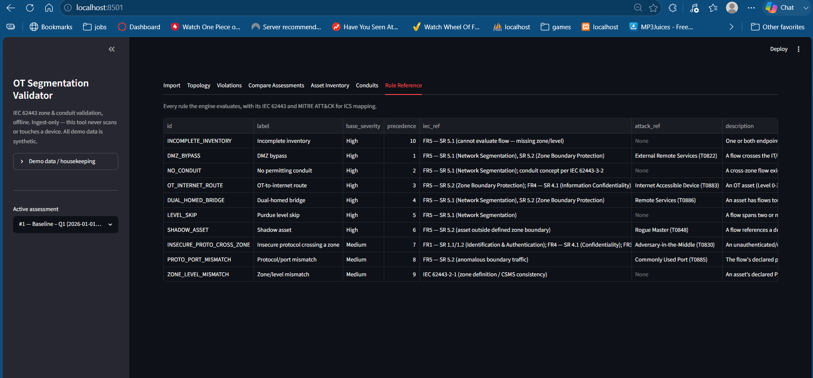

# OT Network Segmentation Validator

An offline Streamlit tool that validates OT/ICS network segmentation against the Purdue Model and IEC 62443 zone/conduit architecture — without ever touching live devices.

Built from real airport OT experience. Ingest-only: you import an asset inventory and conduit map; the tool never scans, never connects.

## What It Does

- **Purdue Model validation** — flags assets placed at the wrong level or bypassing required zone boundaries
- **IEC 62443 zone/conduit rules** — 10-rule engine covering DMZ bypass, level skip, insecure cross-zone protocols, shadow assets, and more
- **Exposure Rating** — computes per-asset reachability (Exposed / Indirect / Isolated) using graph traversal from the Enterprise/DMZ boundary
- **Drift detection** — compare two assessment snapshots to surface resolved violations and newly introduced ones
- **P3 pipeline export** — writes `data/exposure_export.csv` consumed by the [Vulnerability Prioritization Dashboard (P3)](https://github.com/aakashsingh-sec/vulnerability-prioritization-dashboard) to weight CVE risk by zone topology

## Demo Network

35-asset synthetic airport/fuel-farm network seeded on first run — no setup required. Covers:

- Enterprise (Level 4): ERP, AD, email servers
- DMZ (Level 3.5): historian, jump server, patch server
- Supervisory (Level 2): SCADA servers, HMIs, OPC server, DCS
- Operations (Level 3): engineering workstation, process historian, asset management
- Control (Level 1): PLCs, RTUs, lighting controller
- Field (Level 0): sensors, actuators, flow meters
- Safety (SIS): safety controllers and logic solvers
- Supporting: BMS, CCTV, external vendor connections

## Tabs

| Tab | Purpose |
|-----|---------|
| Import | Load asset inventory + conduit map CSV, or seed the demo network |
| Topology | Interactive networkx graph, colored by zone, exposure rating overlay |
| Violations | Rule engine output with IEC 62443 SR references and MITRE ATT&CK for ICS technique IDs |
| Compare Assessments | Drift detection between two saved snapshots |
| Asset Inventory | Full asset table with exposure ratings, Purdue level, zone assignment |
| Conduits | Conduit/connection table with protocol and direction |
| Rule Reference | All 10 rules with severity, IEC 62443 clause, and ATT&CK mapping |

## Exposure Rating

Computed via graph traversal from the Enterprise/DMZ boundary (reachability hops):

| Rating | Definition |
|--------|-----------|
| **Exposed** | 0–1 hops from Enterprise/DMZ — direct internet-facing or single-hop reachable |
| **Indirect** | 2+ hops — reachable but behind zone boundaries |
| **Isolated** | No path exists from the boundary — air-gapped or fully segmented |

Distribution in the demo network: Exposed = 7, Indirect = 21, Isolated = 7.

These ratings are exported to `data/exposure_export.csv` and consumed by P3 to adjust CVE priority by zone context — same CVE scores differently depending on whether the asset is Exposed vs Isolated.

## Rule Engine

10 rules, each tagged with an IEC 62443 SR reference and a MITRE ATT&CK for ICS technique:

| Rule | Severity | IEC 62443 | ATT&CK for ICS |
|------|----------|-----------|----------------|
| INCOMPLETE_INVENTORY | High | FR5 — SR 5.1 | — |
| DMZ_BYPASS | High | FR5 — SR 5.1/5.2 | External Remote Services (T0822) |
| NO_CONDUIT | High | FR5 — SR 5.1 | — |
| OT_INTERNET_ROUTE | High | FR5 — SR 5.2; FR4 — SR 4.1 | Internet Accessible Device (T0883) |
| DUAL_HOMED_BRIDGE | High | FR5 — SR 5.1/5.2 | Remote Services (T0886) |
| LEVEL_SKIP | High | FR5 — SR 5.1 | — |
| SHADOW_ASSET | High | FR5 — SR 5.2 | Rogue Master (T0848) |
| INSECURE_PROTO_CROSS_ZONE | Medium | FR1 — SR 1.1/1.2; FR3 — SR 3.1; FR4 — SR 4.1 | Adversary-in-the-Middle (T0830) |
| PROTO_PORT_MISMATCH | Medium | FR5 — SR 5.2 | Commonly Used Port (T0885) |
| ZONE_LEVEL_MISMATCH | Medium | IEC 62443-2-1 | — |

## Tech Stack

- Python 3.11
- Streamlit (UI)
- SQLite (storage)
- Plotly (charts)
- networkx (topology graph + reachability)
- pandas (tabular display/export)

## Setup

```bash
git clone https://github.com/aakashsingh-sec/ot-segmentation-validator
cd ot-segmentation-validator
py -3.11 -m pip install -r requirements.txt
py -3.11 -m streamlit run app.py
```

On first launch, click **Load synthetic demo data** in the sidebar to load the 35-asset airport/fuel-farm scenario (or run `py -3.11 seed_demo.py` from the command line).

## Tests

```bash
py -3.11 -m pytest tests/ -v
```

26 tests across the rule engine and exposure rating logic. All pass.

## Project Layout

| File / Folder | Purpose |
|---------------|---------|
| `app.py` | Streamlit entry point |
| `config.py` | Purdue levels, zones, IEC 62443/ATT&CK mappings, rule metadata |
| `db.py` | SQLite schema and queries |
| `loader.py` | Hostile-input-safe CSV/JSON import |
| `rules.py` | 10-rule validation engine, including exposure rating computation (`compute_exposure_ratings`/`recompute_exposure`) |
| `grapher.py` | Purdue-tiered topology graph (networkx layout, Plotly render) |
| `seed_demo.py` | Seeds the 35-asset synthetic demo network |
| `exporter.py` | Formula-injection-safe CSV export |
| `tests/test_rules.py` | Rule engine unit tests |
| `tests/test_exposure.py` | Exposure rating unit tests |
| `data/ot_demo_assets.csv` | Canonical 35-asset fixture (shared with P3) |
| `data/exposure_export.csv` | Per-asset exposure ratings exported for P3 consumption |

## Screenshots

**Topology tab — exposure-colored network graph**


**Violations tab — rule hits with IEC 62443 references**


**Asset Inventory — exposure ratings per asset**


**Compare Assessments — drift between Q1 and Q2**


**Rule Reference tab**


---

**Author:** Aakash Singh — [github.com/aakashsingh-sec](https://github.com/aakashsingh-sec)
